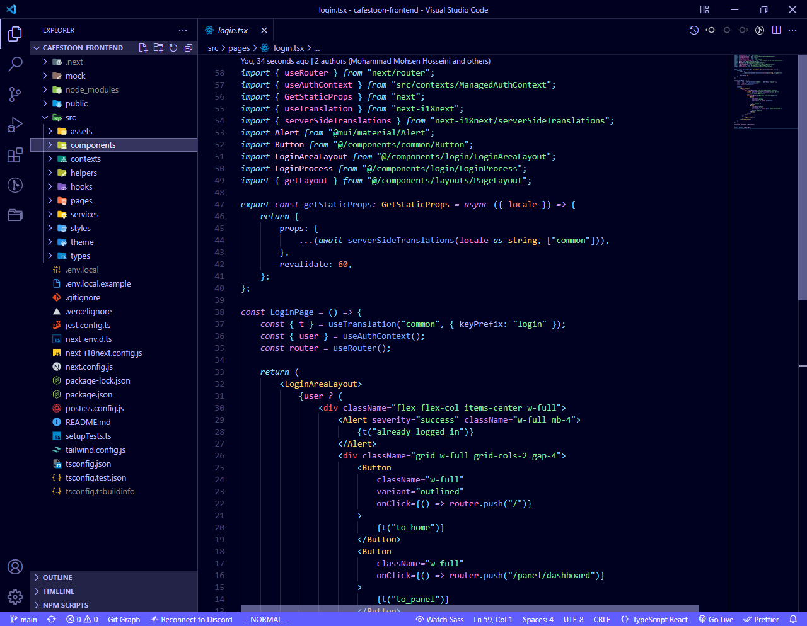
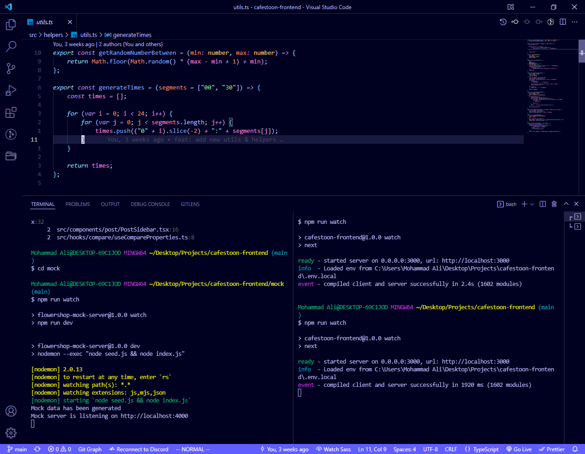

<h1 align="center">
     Nightly Theme  
</h1>

 

Nightly is a dark theme for Visual Studio Code. 
Get it from <b><a href="https://marketplace.visualstudio.com/items?itemName=MohammadAliShahbazi.nightly-theme">Visual Studio Code Marketplace</a></b>

    
Below are some of the screenshots of the actual theme:

     
     
    <em>TypeScript React syntax highlighting & File Explorer</em>
     
     
     
    <em>Splitted terminal view with TypeScript file</em>

 
 
  
For folder and files icons install [Material Icon Theme](https://github.com/PKief/vscode-material-icon-theme)
